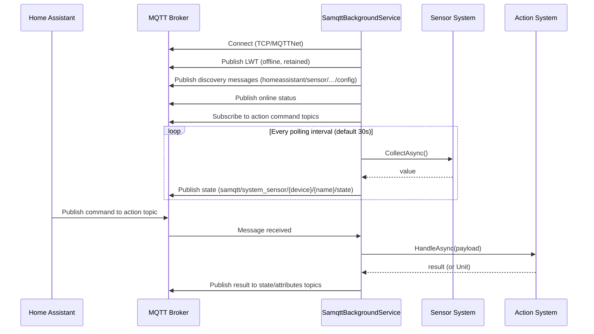
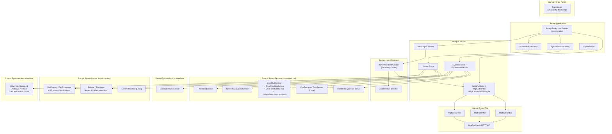

# SAMQTT


Acronym for **Sensors and Actions bridge to MQTT**, SAMQTT is a background service that exposes system sensors to MQTT so that they can be consumed from IOT applications such as Home Assistant.
It can be run in both Windows and Linux.

## Installation

In both Linux and Windows there's an installer available. Keep these values at hand before installing

- **Hostname**, **port** and (optional) **credentials** for your MQTT broker.
- A **device identifier**, usually your system/device/machine hostname.

### Windows

1. Get the latest Windows installer from the [releases](https://github.com/ferarias/samqtt/releases/) section: `SamqttSetup.exe`
2. Double-click the installer and follow the instructions.
3. That's all. SAMQTT will be installed as a Windows Service.
4. You can further customize settings in `%LOCALAPPDATA%\SAMQTT\samqtt.appsettings.json`

### Linux

#### Automated install

```bash
bash <(curl -s https://raw.githubusercontent.com/ferarias/samqtt/master/setup/install-latest-linux.sh)
```

#### Manual install

Get the latest appropriate Linux version from the [releases](https://github.com/ferarias/samqtt/releases/) section.

Example for Linux (X64)
```
wget https://github.com/ferarias/samqtt/releases/latest/download/samqtt-linux-x64.tar.gz
tar xvfz samqtt-linux-x64.tar.gz
cd samqtt
chmod +x install.sh
./install.sh
```

You can further customize settings in `/etc/mqtt/samqtt.appsettings.json`

#### Uninstall
```
/opt/samqtt/uninstall.sh
```

## Architecture

SAMQTT is a .NET 8 Worker Service that bridges system sensors and actions to an MQTT broker, with built-in Home Assistant MQTT Discovery support.

### Data Flow



### Component Overview



### Key Design Principles

- **Factory pattern** — `SystemSensorFactory` and `SystemActionFactory` resolve only enabled sensors/actions from DI at startup, using config keys for lookup.
- **Multi-sensors** — `ISystemMultiSensor` (e.g., `DriveMultiSensor`) enumerates child identifiers (drive letters/mount points) at runtime; the factory creates a keyed instance per child.
- **Actions return values or `Unit`** — `SystemAction<T>` where `T = Unit` is fire-and-forget (no state topic published); any other `T` causes the result to be serialized and published to a state and attributes topic.
- **Home Assistant discovery** — On startup, SAMQTT publishes MQTT discovery payloads to `homeassistant/sensor/{uniqueId}/config` so HA auto-discovers all sensors and actions.
- **AOT-compatible** — JSON serialization uses source-generated contexts (`SamqttBrokerJsonContext`, `SamqttHomeAssistantJsonContext`) with no runtime reflection.
- **Cross-platform** — Shared core with platform-specific assemblies registered conditionally (`#if WINDOWS` / `OperatingSystem.IsLinux()`).

### MQTT Topic Schema

| Topic | Purpose |
|---|---|
| `samqtt/{device}/status` | Online/offline LWT (retained) |
| `samqtt/system_sensor/{device}/{name}/state` | Sensor telemetry |
| `samqtt/system_action/{device}/{name}/request` | Action command (subscribe) |
| `samqtt/system_action/{device}/{name}/state` | Action result |
| `samqtt/system_action/{device}/{name}/attributes` | Action JSON attributes |
| `homeassistant/sensor/{uniqueId}/config` | HA discovery (sensors & actions) |
| `homeassistant/binary_sensor/{uniqueId}/config` | HA discovery (binary sensors) |


## Sensors

Sensors are published to Home Assistant, provided it has the MQTT integration enabled.

State values are published to `samqtt/system_sensor/{device}/{name}/state`, where `{device}` defaults to the machine hostname and is configurable via `DeviceIdentifier` in settings.

See [Sensors](./docs/Sensors.md) to see the list of available sensors and their topics.

## Actions (Listeners)

SAMQTT subscribes to several topics and, when receiving messages, executes a command or action.

See [System Actions](./docs/SystemActions.md) to see the list of available actions and their topics.

## Roadmap

See [this document](./docs/Roadmap.md) to find out what I intend to do in the future.


## Setup

See [this document](./docs/setup.md) to understand how the installers work.
